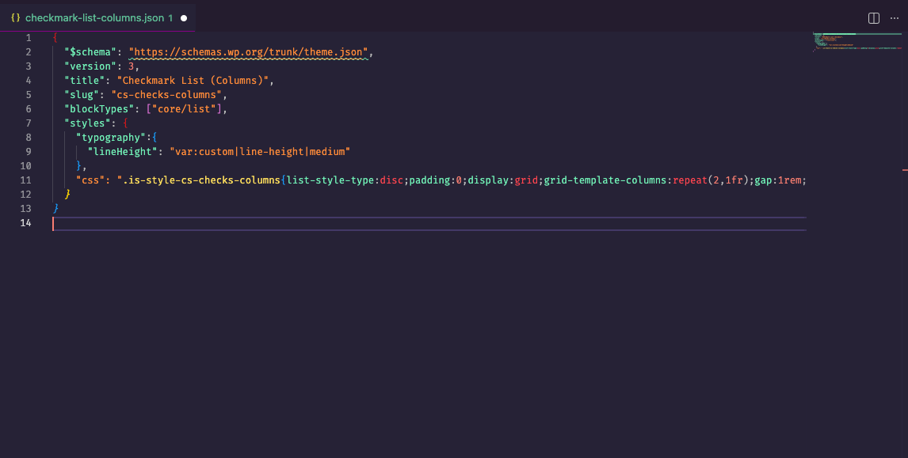

# wp-themejson-css

Syntax highlighting and inline editing for CSS strings embedded in WordPress `theme.json` files.

## Features

### CSS Syntax Highlighting in JSON

The extension injects CSS grammar into `"css"` property values within `theme.json`, providing full syntax highlighting for what would otherwise render as an opaque string.

### Inline CSS Editor

Place your cursor inside a `"css"` string value within a theme.json (or theme.json partial like a block style JSON file) and run the command **WP: Edit inline theme.json CSS** from the Command Palette (`Cmd+Shift+P`).

The minified CSS opens in a side-by-side pane, formatted for readability. Edit the CSS as you normally would, then save (`Cmd+S`). The extension minifies the result with [cssnano](https://cssnano.github.io/cssnano/), re-escapes it, and writes it back into the source JSON automatically.



## Extension Settings

Setting | Type | Default | Description
------- | ---- | ------- | -----------
`wpThemeJsonCss.sortDeclarations` | `boolean` | `false` | Alphabetically sort CSS declarations when minifying back into `theme.json`.

## Development

```sh
npm install
# Press F5 in VS Code to launch the Extension Development Host
```
